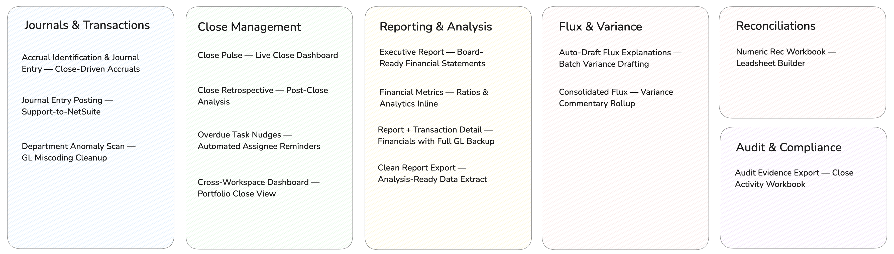

<div align="center">

<br />


<h1>Community Skills for the Numeric MCP</h1>

<h3>Purpose-built AI workflows for accounting teams on Numeric</h3>

<p><a href="https://numeric.io">Numeric</a> is an AI-native accounting platform. The <a href="https://help.numeric.io/articles/7292808089-numeric-mcp-server">Numeric MCP</a> connects it directly to your AI assistant.<br/>These community-built skills turn that connection into ready-to-run accounting workflows.</p>

<br />

<a href="https://github.com/geoff-lew/numeric-toolkit/releases/latest/download/numeric-mcp-toolkit.zip">
  
</a>
&nbsp;
<a href="https://github.com/geoff-lew/numeric-toolkit/releases/latest">
  
</a>
&nbsp;
<a href="#-community-skills">
  
</a>

<br />

<br />

</div>

---

## What is Unlocked with the Numeric MCP

The [Numeric MCP](https://help.numeric.io/articles/7292808089-numeric-mcp-server) is an open protocol connection that gives your AI assistant direct, authenticated access to your Numeric workspace — live data, real actions, no copy-paste.

With it connected, Claude can read and write across your entire close stack:

<table>
<tr>
<td width="33%" valign="top">

### 🏢 Workspace Intelligence
Understand your org structure, open periods, team members, entities, GL connections, and permissions — without you having to explain any of it.

</td>
<td width="33%" valign="top">

### ✅ Close Operations
Full task lifecycle access — create, assign, update, submit, approve, comment, and audit across any period and any entity. Bulk operations in seconds.

</td>
<td width="33%" valign="top">

### 📊 Financial Data
Pull any saved report, build ad-hoc financials on the fly, trend period-over-period data, and drill all the way down to individual journal entry lines.

</td>
</tr>
</table>

**And because MCP is an open standard, Numeric connects naturally with the other tools your team already uses:**

- **Slack MCP** — Post close status updates, send targeted task reminders, and trigger alerts when variances exceed thresholds — all automated, no manual messaging
- **Gmail & Google Calendar MCP** — Draft close status emails for leadership, auto-block close windows in team calendars based on Numeric due dates, send auditor prep packets
- **NetSuite MCP** — Post journal entries directly into NetSuite from a conversation, completing the full loop from accrual identification to posting without leaving Claude

> The Numeric MCP exposes 19 tools across workspace management, close task operations, and financial reporting. Anything you can do in Numeric's Insights feature is now available through Claude — with the ability to chain queries, combine data across systems, and produce formatted outputs you can share directly.

---

## How Numeric and the Numeric MCP Fit Together

**Numeric is the operating system for your accounting team.** Like any OS, it manages state — who owns what, what's been done, what the rules are, what happened last period. Your team runs on top of it. Your processes are encoded in it. Your institutional knowledge accumulates inside it.

Use task descriptions to store how a workflow should run. Reference prior period commentary to understand recurring patterns. Record preferences, exceptions, and policies directly in Numeric so they carry forward automatically — not locked in someone's head or buried in a spreadsheet.

**The Numeric MCP is what lets your AI run on that operating system.** It exposes Numeric's full state to Claude — live tasks, financial data, team structure, history, commentary — and it's bidirectional. The AI doesn't just read; it writes results back, updates tasks, posts comments, and keeps the record current. An AI connected via the MCP isn't answering generic questions; it's operating with full awareness of your team and where things stand right now.

**Together, the MCP supercharges what Numeric can do natively.** Numeric tracks the work — the MCP executes it. Draft flux explanations across every assigned account in one run. Identify accrual candidates from transaction history and post the journal entries. Send targeted Slack reminders based on who's behind and what preferences you've set. Everything that would otherwise require manual steps, a separate script, or a tool outside Numeric can now happen directly from a conversation — with results written back into Numeric where they belong.

Skills in this toolkit are built on that model.

---

## Community Skills

### What are skills?

Skills are pre-built AI playbooks for automating specific accounting workflows. Each skill knows exactly what to ask, what data to pull from Numeric, how to process it, and what to produce — so you don't have to figure it out each time.

Instead of describing a multi-step workflow from scratch, you just describe what you need in plain language and the right skill activates automatically. Think of them as the difference between having an AI assistant and having an AI assistant that already knows how to do your job.

Skills in this toolkit span six workflow areas — journals and transactions, close management, flux and variance, reporting and analysis, reconciliation, and audit. Each one is available individually as a `.skill` file or bundled together in the full plugin.

<br/>

<div align="center">



</div>

<br/>

---

### Journals & Transactions

<details open>
<summary>&nbsp;&nbsp;<strong>Accrual Identification & Journal Entry — Close-Driven Accruals</strong></summary>
<br/>

Pulls accrual-related tasks from your Numeric close checklist, analyzes the underlying GL data to identify potential accruals that need to be booked, and builds the full supporting workbook as evidence — then generates the corresponding journal entries ready for NetSuite posting. The entire accrual workflow in one conversation: identify, document, and post.

[⬇ Download complete-accruals-task.skill](https://github.com/geoff-lew/numeric-toolkit/releases/latest/download/complete-accruals-task.skill)

**Ask things like:** *"Run the accruals for this period" · "What accruals do we need to book?" · "Identify and create the month-end accrual entries"*

</details>

<br/>

<details>
<summary>&nbsp;&nbsp;<strong>Journal Entry Posting — Support-to-NetSuite</strong></summary>
<br/>

Pulls outstanding journal entry tasks from your Numeric close checklist, reads the supporting workbook or documentation provided, generates the balanced journal entries, marks the task complete in Numeric, and posts directly to NetSuite via the NetSuite MCP. From checklist task to posted entry — no manual steps in between.

[⬇ Download journal-entry-generator.zip](https://github.com/geoff-lew/numeric-toolkit/releases/latest/download/journal-entry-generator.zip)

**Ask things like:** *"Post the outstanding journal entries" · "Process the JE tasks from the checklist" · "Complete and post the JEs with this support"*

</details>

<br/>

<details>
<summary>&nbsp;&nbsp;<strong>Department Anomaly Scan — GL Miscoding Cleanup</strong></summary>
<br/>

Scans your workspace for GL-to-department coding anomalies — expenses hitting the wrong cost center, vendors consistently miscoded, accounts landing in unexpected departments. Surfaces patterns and generates the NetSuite reclass journal entry CSV to fix them.

[⬇ Download dept-anomaly-scan.skill](https://github.com/geoff-lew/numeric-toolkit/releases/latest/download/dept-anomaly-scan.skill)

**Ask things like:** *"Scan for department anomalies" · "Find GL miscodings" · "Anything miscoded this period?"*

</details>

---

### Close Management

<details open>
<summary>&nbsp;&nbsp;<strong>Close Pulse — Live Close Dashboard</strong></summary>
<br/>

You shouldn't have to open Numeric to know where your close stands. Close Pulse pulls task completion rates, surfaces overdue items flagged by materiality, maps blocking dependencies, and tells you whether you're ahead or behind pace — all in a single conversation. Built for controllers and close managers who need a fast, honest read on close health.

[⬇ Download close-pulse.skill](https://github.com/geoff-lew/numeric-toolkit/releases/latest/download/close-pulse.skill)

**Ask things like:** *"How's the close going?" · "What's overdue?" · "Are we on track?" · "Who's behind?"*

</details>

<br/>

<details>
<summary>&nbsp;&nbsp;<strong>Close Retrospective — Post-Close Analysis</strong></summary>
<br/>

Every close has a story. Close Retro reads it for you. After each period, it analyzes task completion timelines, review cycle counts, late submissions, assignee workload, and pace versus prior periods — then surfaces the patterns that matter. Which tasks consistently run late? Which reviewers are bottlenecks? Outputs as a Slack digest or structured summary.

[⬇ Download close-retro.zip](https://github.com/geoff-lew/numeric-toolkit/releases/download/v1.0.1/close-retro-skill.zip)]

**Ask things like:** *"How did the close go?" · "What took longest?" · "Compare this close to last quarter"*

</details>

<br/>

<details>
<summary>&nbsp;&nbsp;<strong>Overdue Task Nudges — Automated Assignee Reminders</strong></summary>
<br/>

Chasing people down during close is a full-time job. This skill handles it. It identifies tasks that are overdue or due soon and sends targeted Slack DMs to assignees with contextual messages — not generic notifications. Reads reminder preferences from each task, logs every nudge as a comment to prevent duplicates, and can run on a daily schedule during close week.

[⬇ Download overdue-task-nudge.skill](https://github.com/geoff-lew/numeric-toolkit/releases/latest/download/overdue-task-nudge.skill)

**Ask things like:** *"Remind assignees about overdue tasks" · "Send close reminders" · "Nudge people on late recs"*

</details>

<br/>

<details>
<summary>&nbsp;&nbsp;<strong>Cross-Workspace Dashboard — Portfolio Close View</strong></summary>
<br/>

Managing multiple workspaces? This skill rolls up close progress across all your Numeric workspaces into a single portfolio-level view — completion rates, overdue counts, pace comparisons, and workload distribution side by side. Outputs as an HTML dashboard and companion Excel workbook.

[⬇ Download cross-workspace-dashboard.skill](https://github.com/geoff-lew/numeric-toolkit/releases/latest/download/cross-workspace-dashboard.skill)

**Ask things like:** *"Close status across all entities" · "Which workspaces are behind?" · "Portfolio close view"*

</details>

---

### Flux & Variance

<details open>
<summary>&nbsp;&nbsp;<strong>Auto-Draft Flux Explanations — Batch Variance Drafting</strong></summary>
<br/>

Loops through every flux task assigned to the current user in Numeric where an explanation has been requested, pulls six months of transaction line history per account, and posts concise first-pass drafts directly back to Numeric — ready for the preparer to review and submit. Appends below any existing content rather than overwriting. Run it once at the start of close and your flux queue is handled.

[⬇ Download automatically-draft-flux-explanations.skill](https://github.com/geoff-lew/numeric-toolkit/releases/latest/download/automatically-draft-flux-explanations.skill)

**Ask things like:** *"Write my flux explanations" · "Draft all my fluxes for this month" · "Run the flux analysis for close"*

</details>

<br/>

<details>
<summary>&nbsp;&nbsp;<strong>Consolidated Flux — Variance Commentary Rollup</strong></summary>
<br/>

Pulls flux commentary from across entities, reports, and periods and stitches it into a single unified narrative — rolling child account explanations up to group level, trending commentary across months. Essential for multi-entity teams who need one coherent story across the books.

[⬇ Download consolidated-flux.skill](https://github.com/geoff-lew/numeric-toolkit/releases/latest/download/consolidated-flux.skill)

**Ask things like:** *"Consolidate flux across entities" · "Roll up variance commentary" · "Unified variance view"*

</details>

---

### Reporting & Analysis

<details open>
<summary>&nbsp;&nbsp;<strong>Executive Report — Board-Ready Financial Statements</strong></summary>
<br/>

Takes your Numeric report and produces a polished, presentation-ready financial statement — collapsing child account detail into executive summary groups, rolling up flux commentary into one-line narratives, and applying professional formatting. Output as a styled Excel workbook or PDF. Built for CFO decks, board packages, and investor reporting.

[⬇ Download executive-report.skill](https://github.com/geoff-lew/numeric-toolkit/releases/latest/download/executive-report.skill)

**Ask things like:** *"Build the board report" · "CFO-ready income statement" · "Collapse the P&L into summary groups"*

</details>

<br/>

<details>
<summary>&nbsp;&nbsp;<strong>Financial Metrics — Ratios & Analytics Inline</strong></summary>
<br/>

Standard financial ratios computed directly onto your Numeric report. Covers profitability, liquidity, solvency, and working capital metrics — placed inline on both income statements and balance sheets. Useful for covenant reporting, investor updates, and management analysis.

[⬇ Download financial-metrics.skill](https://github.com/geoff-lew/numeric-toolkit/releases/latest/download/financial-metrics.skill)

**Ask things like:** *"Add financial ratios to this report" · "What's our gross margin?" · "Check covenant compliance"*

</details>

<br/>

<details>
<summary>&nbsp;&nbsp;<strong>Report + Transaction Detail — Financials with Full GL Backup</strong></summary>
<br/>

Pulls any Numeric report alongside every underlying GL transaction line — in a single Excel workbook with two tabs. The financial statement on one side, every journal entry behind each number on the other. Built for controllers who need to explain variances or provide detail to auditors without a separate export.

[⬇ Download report-txn-detail.skill](https://github.com/geoff-lew/numeric-toolkit/releases/latest/download/report-txn-detail.skill)

**Ask things like:** *"Report with transaction detail" · "Income statement with journal entries" · "Show me what makes up each line"*

</details>

<br/>

<details>
<summary>&nbsp;&nbsp;<strong>Clean Report Export — Analysis-Ready Data Extract</strong></summary>
<br/>

Exports any Numeric financial statement as a clean CSV or TSV — no summary rows, no formatting artifacts, no manual cleanup. Drop it straight into Excel, pandas, or any BI tool. Supports multiple reports in a single run.

[⬇ Download clean-report-export.skill](https://github.com/geoff-lew/numeric-toolkit/releases/latest/download/clean-report-export.skill)

**Ask things like:** *"Export the income statement" · "Get me a clean CSV" · "Pull the report data for analysis"*

</details>

---

### Reconciliation

<details>
<summary>&nbsp;&nbsp;<strong>Numeric Rec Workbook — Leadsheet Builder</strong></summary>
<br/>

Builds a polished Numeric Leadsheet workbook for any GL account — four periods of live balance data, EOMONTH date formulas, and a rollforward tab. One row per account × entity. Also supports adding a Numeric tab to an existing workbook without touching your other sheets.

[⬇ Download numeric-rec-workbook.skill](https://github.com/geoff-lew/numeric-toolkit/releases/latest/download/numeric-rec-workbook.skill)

**Ask things like:** *"Build rec support for Prepaid" · "Make me the leadsheet for this account"*

</details>

---

### Audit & Compliance

<details>
<summary>&nbsp;&nbsp;<strong>Audit Evidence Export — Close Activity Workbook</strong></summary>
<br/>

Packages the complete activity history of any Numeric close period into a structured five-sheet Excel workbook — reconciliation submissions and approvals, checklist completions, review notes, and a full timeline of who did what and when. Hand it to your auditors and move on.

[⬇ Download audit-evidence-export.skill](https://github.com/geoff-lew/numeric-toolkit/releases/latest/download/audit-evidence-export.skill)

**Ask things like:** *"Audit evidence for December close" · "SOX evidence package" · "Reconciliation sign-off history"*

</details>

---

## Tips

### Use your close checklist to drive automations

Your Numeric close checklist is more than a task list — it's the control plane for your close workflow. Skills read task status, due dates, assignees, and descriptions directly from the checklist, which means your existing tasks can help to drive your workflows by instructing your AI to take specific actions.

For example: create an *Accruals* task in Numeric with a due date of day 3. The accrual skill reads the list of tasks, knows what's expected and if any need to be handled, runs the workflow, and marks it complete — all triggered by a single instruction.

### Use task descriptions to carry preferences and instructions forward

You can store workflow preferences and specific instructions directly in a task description, and the skill will read them on every run. Use this to note any changes you want applied going forward — no need to re-specify them each time.

```
## Skill preferences
- Reminder cadence: only send nudges if 48+ hours since last reminder
- Output format: Excel workbook, save to /Close Workpapers/Prepaid/
- Reviewer: Tag Sarah in the Slack message when complete
```

### Let skills self-track via comments

Skills can automatically log a comment on the relevant Numeric task after they run — recording what was done, when, and what the outcome was. This creates a native audit trail inside Numeric and lets skills make smart decisions on subsequent runs. For example, the overdue nudge skill will check the comment history before sending a reminder, so it won't re-notify someone if they were already nudged in the last 48 hours.

### If a skill doesn't trigger automatically, be explicit

Skills activate based on how you phrase your request. If Claude responds without using the right skill, just tell it directly which one to use:

> *"Use the close-pulse skill to show me where the close stands."*
> *"Run the automatically-draft-flux-explanations skill for this period."*

You can also ask Claude which skills are available: *"What skills do you have installed?"*

### Customize a skill to fit your workflow

Once installed, any skill can be refined to match your team's specific process. Open a conversation and ask Claude:

> *"Update the close-pulse skill so that it always groups overdue tasks by assignee first, skips tasks tagged 'on hold', and posts the summary to #accounting-close in Slack instead of responding in chat."*

Claude will modify the skill in place. Your customized version becomes the default for future runs — no coding required. Combine with task descriptions to give Claude a 'working memory'.

---

## Get Started

### 1. Connect the Numeric MCP

See the [Numeric MCP setup guide](https://help.numeric.io/articles/7292808089-numeric-mcp-server) to connect your workspace. Once authenticated, Claude has direct access to your Numeric data.

### 2. Install the skills

<table>
<tr>
<td width="50%" valign="top">

**Full plugin** — all skills at once

Download [`numeric-mcp-toolkit.zip`](https://github.com/geoff-lew/numeric-toolkit/releases/latest) and open it in Cowork or Claude Code.

Or via CLI:
```
/plugin marketplace add geoff-lew/numeric-toolkit
/plugin install numeric-mcp-toolkit
```

</td>
<td width="50%" valign="top">

**Individual skill** — just what you need

Download any `.skill` file from the [Releases tab](https://github.com/geoff-lew/numeric-toolkit/releases/latest) and open it in Cowork or Claude Code.

Each `.skill` file is fully self-contained — no extra setup.

</td>
</tr>
</table>

### 3. Start working

Just describe what you need. The right skill activates automatically based on what you ask. No configuration required beyond authentication.

---

## Community & Contributing

These skills are built and maintained by the Numeric community. We welcome new skills — if you've built a workflow that saves your team time, share it and let others benefit too.

### How to contribute a skill

The easiest way: build the workflow you want in Claude, then ask it to *"bundle this into a skill"*. Claude will package it into the right format. Send it to [support@numeric.io](mailto:support@numeric.io) and we'll add it to the toolkit.

### Have an idea?

We're happy to help design and build new skills with you — whether it's a manual process you've been repeating every close, a recurring deliverable, or a workflow that would save your team hours each month. Reach out to [support@numeric.io](mailto:support@numeric.io) and tell us what you're trying to do.

---

<div align="center">

MIT License · Community-maintained · Built for [Numeric](https://numeric.io)

</div>
